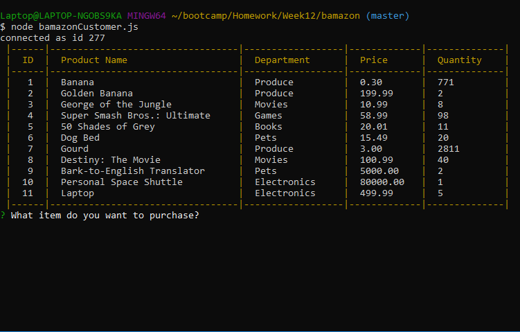
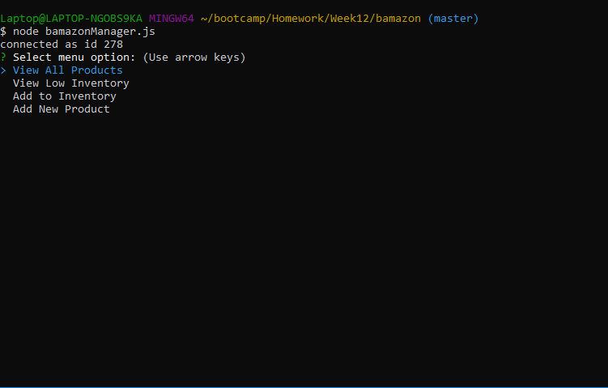
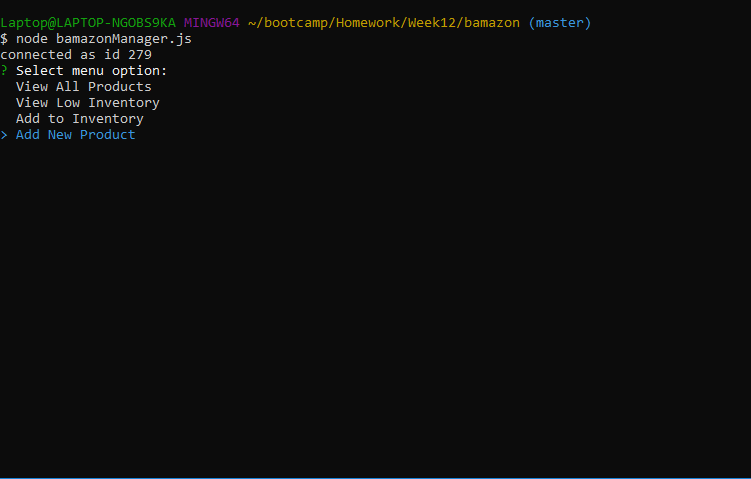

# **"Bamazon" Store**

## Week 12 Homework Assignment, Coding Boot Camp, UNC-Chapel Hill

Originally submitted on 1/24/2019

### Instructions

- CLI script run via node.js
- Mock storefront using MySQL for the database
- Customer can "buy" items
- Manager can manage store

### About

This is a mock storefront for a department store like Amazon (hence the name). It uses MySQL to manage the database to track inventory. The user in bamazonCustomer.js can view current stock and make simulated purchases and the stock updates accordingly.

The user in bamazonManager.js has more options: view all products, view low inventory products, order more products, or add an entirely new product. Again, relevant features update the database appropriately.

### Example Gifs

Customer buying products

Manager increasing inventory of current item

Manager adding new product to store

Created by Barry Riveroll //
[Github](https://github.com/barryriveroll) //
[Portfolio](https://barryriveroll.github.io/Portfolio/)
